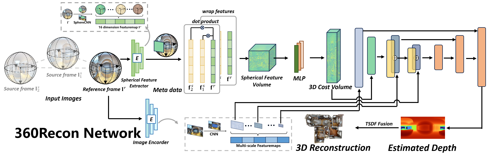

# 360Recon
The repo of the paper ["360Recon: An Accurate Reconstruction Method Based on Depth Fusion from 360 Images"](https://arxiv.org/abs/2411.19102). Our paper has been accepted by IROS2025.  



## Setup

* You can install dependencies with:
```shell
conda env create -f 360Recon_env.yml
```

* Then you need to compile the Spherical Convolution operator with following bash command:
```shell
cd spherical_conv/basic/spherical_conv && bash ./build.sh && cd ../../../
```

## Dataset

We use publicly available [Matterport3D](https://niessner.github.io/Matterport/) and [Stanford2D3D](https://github.com/alexsax/2D-3D-Semantics) datasets, which contain equirectangular images as well as ground-truth depth and mesh data.
You can apply for access and download them yourself.

## Pretrained-Model

You can download our [pretrained model](https://drive.google.com/file/d/1K3J_Egu5ban9hOOS6KbBf9NniOA5PYfp/view?usp=drive_link) and place it in the weights folder.

## Test

The test code supports multiple modes, including a fast mode for quickly evaluating metrics:

```bash
python test.py --name PANO_MODE \
        --output_base_path OUTPUT_PATH \
        --config_file configs/models/pano_model.yaml \
        --load_weights_from_checkpoint weights/360Recon.ckpt \
        --data_config configs/data/metterport3d_default_test.yam \
        --num_workers 1 \
        --batch_size 1;
```
    
   Run with depth prediction outputs and ground-truth depth visualization：

```bash
python test.py --name PANO_MODE \
        --output_base_path OUTPUT_PATH \
        --config_file configs/models/pano_model.yaml \
        --load_weights_from_checkpoint weights/360Recon.ckpt \
        --data_config configs/data/metterport3d_default_test.yam \
        --num_workers 1 \
        --batch_size 1 \
        --dump_depth_visualization;
```

Run with both depth prediction and 3D reconstruction mesh outputs：

```bash
python test.py --name PANO_MODE \
        --output_base_path OUTPUT_PATH \
        --config_file configs/models/pano_model.yaml \
        --load_weights_from_checkpoint weights/360Recon.ckpt \
        --data_config configs/data/metterport3d_default_test.yam \
        --num_workers 1 \
        --batch_size 1 \
        --run_fusion   \
        --depth_fuser ours \
        --fuse_color    \
        --dump_depth_visualization;
```
## Acknowledgements

We thank the authors of [**SimpleRecon**](https://github.com/nianticlabs/simplerecon) for their clear and well-structured codebase, which greatly helped our framework design.  

We also thank the authors of [**TransformerFusion**](https://github.com/AljazBozic/TransformerFusion) for providing useful evaluation scripts for rapid reconstruction testing.  

The spherical convolution design in [**MODE**](https://github.com/nju-ee/MODE-2022) was an important technical reference for our spherical feature extractor.

Finally, [**SphereSfM**](https://github.com/json87/SphereSfM) made it possible to obtain ERP-format panoramic poses from real-world data for robustness testing.

## BibTeX

Please cite our paper if you find this work useful：

```
@article{yan2024360recon,
  title={360Recon: An accurate reconstruction method based on depth fusion from 360 images},
  author={Yan, Zhongmiao and Wu, Qi and Xia, Songpengcheng and Deng, Junyuan and Mu, Xiang and Jin, Renbiao and Pei, Ling},
  journal={arXiv preprint arXiv:2411.19102},
  year={2024}
}
```
